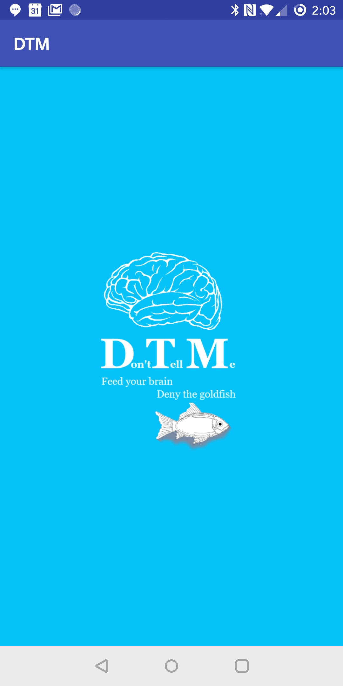

# cs480-DTM

## Overview:

**Don't Tell Me** is a memory game for the HSU SP18 Mobile Apps class.

The game that seeks to reclaim your outsourced memory from the google bots that are destroying the fabric of the human mind.  Speak a short description of a movie you remember and look at clues!  And when you're ready, guess the name!   

---
## Features:
0. Takes voice input from user.
1. We send the voice file as a api call to google: converting voice to text and returning the text.
2. We send the text to a Google Custom Search as an api call back to google: returning a movie title.  
3. We then send the movie title to IMDB as an api call: returning clues!
	- word association 
	- pictures
	- quotes
	- other characters
4. all clues can be bought and observed for five seconds before they disappear forever.  
5.  When you're ready, either guess the movie, give up, or click "not my movie", to populate the next highest hit for a match.  Don't worry, clues you buy are still there on the second title!

---
## Next steps and TODO:

6. gameification 
	- points
	- levels
7. sending challenges to friends.
8. signin : google.

---
## authors:
- Sam Alston
- Jack Daniel Kinne
- Tom Murphy

## Class:
CS 480 Mobile Apps